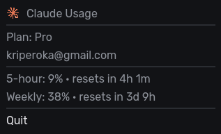

  
  <h1 align="center">Claude usage tray</h1>

  A lightweight Linux tray application which shows Claude usage and limits

  

## About

> [!NOTE]
> This is an unofficial, hobby project. It is not affiliated with, endorsed by, or associated with Anthropic.

This is a simple Linux application that works in your tray and shows current Claude usage on hover. It displays information like 5h usage limit, weekly limit, reset times, information about usage credits (used, limit and balance) and plan details.

It works with **any** window manager, as it works based on desktop-environment-agnostic D-Bus protocol. Basically, it registers itself as a service on the session D-Bus and let's the actual window manager to do the rest by itself.

**The app requires for the user to be logged in into their Claude account** via `claude` CLI (`claude auth login` or `/login`) or the desktop application, and **requires a paid subscription plan** (Pro, Max, ect.). Without this account token it won't work, because it fetches usage from Anthropic's API for paid subscription plans.

## Config

The configuration file is located at `~/.config/claude-usage-tray/config.toml`. It allows to specify claude credentials paths, poll intervals and timeouts. 

But most importantly it allows to toggle each display element individually or the whole group of elements. **By default usage credits are hidden** - enable them by setting `display.credits.show = true`.

## Install

Installation details coming soon

